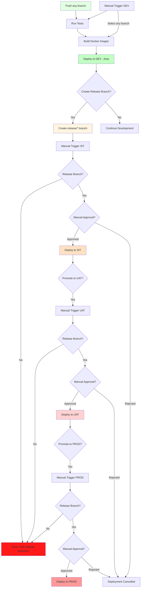

# Multi-Environment Deployment Guide

## 🎯 Overview

This document describes the multi-environment deployment pipeline for the Finance Tracker application. The pipeline supports 4 environments with manual promotion between stages.

## 📊 Environments

| Environment | Purpose | Branch Requirement | Trigger | Deployment Type |
|------------|---------|-------------------|---------|-----------------|
| **DEV** | Development | Any branch | Push to any branch or manual workflow dispatch | Automatic on push, Manual via workflow_dispatch |
| **SIT** | System Integration Testing | Release branches only (`release/*`) | Manual workflow dispatch | Manual approval required |
| **UAT** | User Acceptance Testing | Release branches only (`release/*`) | Manual workflow dispatch | Manual approval required |
| **PROD** | Production | Release branches only (`release/*`) | Manual workflow dispatch | Manual approval required |

## 🔄 Deployment Flow



## 🚀 Deployment Workflow

### 1. DEV Environment (Automatic or Manual)

**Automatic Trigger:** Push to any branch

**Manual Trigger:** Workflow dispatch with any branch

**Process:**
1. Run unit tests
2. Build Docker images
3. Push to ECR with branch-specific tags
4. Deploy to DEV EC2 automatically (on push) or manually
5. Run health checks

**Automatic Deployment Example:**
```bash
# Push any branch - automatically deploys to DEV
git checkout feature/my-feature
git add .
git commit -m "Feature: Add new feature"
git push origin feature/my-feature
```

**Manual Deployment Example:**
1. Go to GitHub Actions tab
2. Select "Multi-Environment Deployment Pipeline"
3. Click "Run workflow"
4. Select branch: your feature branch (e.g., `feature/my-feature`)
5. Select environment: `DEV`
6. Click "Run workflow"

**Note:** DEV allows multiple branches to run simultaneously using project names like `finance-feature/my-feature`

### 2. SIT Environment (Manual - Release Branches Only)

**Trigger:** Manual workflow dispatch

**Prerequisites:**
- Must be a release branch (format: `release/*`)
- Branch must exist in repository
- Manual approval required (if configured)

**Process:**
1. Create a release branch: `git checkout -b release/v1.0.0`
2. Push release branch: `git push origin release/v1.0.0`
3. Go to GitHub Actions tab
4. Select "Multi-Environment Deployment Pipeline"
5. Click "Run workflow"
6. Select branch: `release/v1.0.0`
7. Select environment: `SIT`
8. Click "Run workflow"
9. Wait for manual approval (if configured)
10. Deploy to SIT EC2
11. Run health checks

**Example:**
```bash
# Create and push release branch
git checkout main
git pull origin main
git checkout -b release/v1.0.0
git push origin release/v1.0.0
```

**Note:** Only release branches (`release/*`) can be deployed to SIT. Other branches will be rejected.

**Required GitHub Secrets:**
- `SIT_EC2_PRIVATE_KEY`
- `SIT_EC2_HOST`
- `SIT_POSTGRES_PASSWORD`
- `SIT_JWT_SECRET`
- `SIT_S3_BUCKET_NAME`
- `SIT_EC2_PUBLIC_IP`

### 3. UAT Environment (Manual - Release Branches Only)

**Trigger:** Manual workflow dispatch

**Prerequisites:**
- Must be a release branch (format: `release/*`)
- Branch must be deployed to SIT first
- Manual approval required (if configured)

**Process:**
1. Ensure the release branch is deployed to SIT
2. Go to GitHub Actions tab
3. Select "Multi-Environment Deployment Pipeline"
4. Click "Run workflow"
5. Select branch: `release/v1.0.0` (same as SIT)
6. Select environment: `UAT`
7. Click "Run workflow"
8. Wait for manual approval (if configured)
9. Deploy to UAT EC2
10. Run health checks

**Note:** Sequential promotion required: DEV → SIT → UAT. Cannot skip SIT.

**Required GitHub Secrets:**
- `UAT_EC2_PRIVATE_KEY`
- `UAT_EC2_HOST`
- `UAT_POSTGRES_PASSWORD`
- `UAT_JWT_SECRET`
- `UAT_S3_BUCKET_NAME`
- `UAT_EC2_PUBLIC_IP`

### 4. PROD Environment (Manual - Release Branches Only)

**Trigger:** Manual workflow dispatch

**Prerequisites:**
- Must be a release branch (format: `release/*`)
- Branch must be deployed to UAT first
- Manual approval required (if configured)

**Process:**
1. Ensure the release branch is deployed to UAT
2. Go to GitHub Actions tab
3. Select "Multi-Environment Deployment Pipeline"
4. Click "Run workflow"
5. Select branch: `release/v1.0.0` (same as UAT)
6. Select environment: `PROD`
7. Click "Run workflow"
8. Wait for manual approval (if configured)
9. Deploy to PROD EC2
10. Run health checks

**Note:** Sequential promotion required: DEV → SIT → UAT → PROD. Cannot skip environments.

## 🎯 Sequential Promotion Flow

### Promotion Rules

1. **DEV → SIT**: Requires release branch (`release/*`)
2. **SIT → UAT**: Requires same release branch to be in SIT
3. **UAT → PROD**: Requires same release branch to be in UAT

### Branch Naming Conventions

| Branch Type | Pattern | Example | Can Deploy To |
|-------------|---------|---------|---------------|
| Feature | `feature/*` | `feature/add-login` | DEV only |
| Bugfix | `bugfix/*` | `bugfix/fix-crash` | DEV only |
| Hotfix | `hotfix/*` | `hotfix/urgent-fix` | DEV only |
| Release | `release/*` | `release/v1.0.0` | DEV, SIT, UAT, PROD |
| Main | `main` | `main` | DEV only (use release branch for other envs) |

### Example Promotion Sequence

```bash
# 1. Developer works on feature branch
git checkout -b feature/new-dashboard
git push origin feature/new-dashboard
# Automatically deploys to DEV

# 2. Create release branch after testing in DEV
git checkout main
git merge feature/new-dashboard
git tag v1.0.0
git checkout -b release/v1.0.0
git push origin release/v1.0.0

# 3. Deploy to SIT (manual trigger with release/v1.0.0)
# 4. After SIT approval, deploy to UAT (manual trigger with release/v1.0.0)
# 5. After UAT approval, deploy to PROD (manual trigger with release/v1.0.0)

# 6. Merge release to main and delete release branch
git checkout main
git merge release/v1.0.0
git push origin main
git branch -d release/v1.0.0
git push origin --delete release/v1.0.0
```

**Required GitHub Secrets:**
- `PROD_EC2_PRIVATE_KEY`
- `PROD_EC2_HOST`
- `PROD_POSTGRES_PASSWORD`
- `PROD_JWT_SECRET`
- `PROD_S3_BUCKET_NAME`
- `PROD_EC2_PUBLIC_IP`

## 🔐 Required GitHub Secrets

### Common Secrets (All Environments)
```
AWS_ACCESS_KEY_ID          # AWS access key for ECR/S3
AWS_SECRET_ACCESS_KEY      # AWS secret key for ECR/S3
```

### DEV Environment Secrets
```
DEV_EC2_PRIVATE_KEY        # SSH private key for DEV EC2
DEV_EC2_HOST               # DEV EC2 public IP or hostname
DEV_POSTGRES_PASSWORD      # PostgreSQL password for DEV
DEV_JWT_SECRET             # JWT secret for DEV
DEV_S3_BUCKET_NAME         # S3 bucket name for DEV
DEV_EC2_PUBLIC_IP          # DEV EC2 public IP
```

### SIT Environment Secrets
```
SIT_EC2_PRIVATE_KEY        # SSH private key for SIT EC2
SIT_EC2_HOST               # SIT EC2 public IP or hostname
SIT_POSTGRES_PASSWORD      # PostgreSQL password for SIT
SIT_JWT_SECRET             # JWT secret for SIT
SIT_S3_BUCKET_NAME         # S3 bucket name for SIT
SIT_EC2_PUBLIC_IP          # SIT EC2 public IP
```

### UAT Environment Secrets
```
UAT_EC2_PRIVATE_KEY        # SSH private key for UAT EC2
UAT_EC2_HOST               # UAT EC2 public IP or hostname
UAT_POSTGRES_PASSWORD      # PostgreSQL password for UAT
UAT_JWT_SECRET             # JWT secret for UAT
UAT_S3_BUCKET_NAME         # S3 bucket name for UAT
UAT_EC2_PUBLIC_IP          # UAT EC2 public IP
```

### PROD Environment Secrets
```
PROD_EC2_PRIVATE_KEY       # SSH private key for PROD EC2
PROD_EC2_HOST              # PROD EC2 public IP or hostname
PROD_POSTGRES_PASSWORD     # PostgreSQL password for PROD
PROD_JWT_SECRET            # JWT secret for PROD
PROD_S3_BUCKET_NAME        # S3 bucket name for PROD
PROD_EC2_PUBLIC_IP         # PROD EC2 public IP
```

## 📋 Setting Up GitHub Secrets

### Step 1: Navigate to Repository Settings
1. Go to your GitHub repository
2. Click on "Settings"
3. Click on "Secrets and variables" → "Actions"
4. Click "New repository secret"

### Step 2: Add Secrets
Add each secret with the corresponding value from the list above.

**Example:**
- Name: `DEV_EC2_HOST`
- Value: `ec2-xx-xx-xx-xx.compute-1.amazonaws.com`

## 🛡️ Configuring Manual Approvals

### Step 1: Add Environment Protection Rules
1. Go to repository Settings
2. Click on "Environments"
3. Click "New environment"
4. Create environments: `SIT`, `UAT`, `PROD`
5. For each environment:
   - Enable "Required reviewers"
   - Add reviewers (team members)
   - Enable "Wait timer" (optional, e.g., 30 minutes)
   - Enable "Deployment branches" (optional)

### Step 2: Configure Branch Protection
1. Go to repository Settings
2. Click on "Branches"
3. Add rule for `main` branch:
   - Require pull request reviews
   - Require status checks to pass
   - Require branches to be up to date

## 📊 Monitoring Deployments

### View Deployment Status
1. Go to "Actions" tab in GitHub
2. Click on the workflow run
3. View job status and logs
4. Check deployment environment URL

### Health Checks
Each deployment includes automated health checks:
- API Gateway: `http://<EC2_HOST>:8080/actuator/health`
- Ingestion Service: `http://<EC2_HOST>:8081/actuator/health`
- Analytics Service: `http://<EC2_HOST>:8084/actuator/health`

## 🔄 Rollback Procedure

If a deployment fails, automatic rollback jobs are triggered for each environment.

### Automatic Rollback
The workflow includes environment-specific rollback jobs that run automatically on deployment failure:
- `rollback-dev` - Rolls back DEV deployment
- `rollback-sit` - Rolls back SIT deployment
- `rollback-uat` - Rolls back UAT deployment
- `rollback-prod` - Rolls back PROD deployment

### Manual Rollback
1. SSH into the EC2 instance
2. Navigate to application directory
3. Checkout previous commit
4. Restart services

```bash
# For DEV with branch-specific deployment
ssh -i private_key.pem ubuntu@<DEV_EC2_HOST>
cd /home/ubuntu/finance-tracker
git log  # Find previous commit hash
git checkout <previous-commit-hash>
docker-compose -p finance-<branch-name> down
docker-compose -p finance-<branch-name> up -d

# For SIT/UAT/PROD
ssh -i private_key.pem ubuntu@<EC2_HOST>
cd /home/ubuntu/finance-tracker
git log  # Find previous commit hash
git checkout <previous-commit-hash>
docker-compose down
docker-compose up -d
```

## 🎯 Best Practices

### 1. Branch Strategy
- Any branch can be deployed to DEV automatically on push
- Feature branches (`feature/*`) for development - DEV only
- Bugfix branches (`bugfix/*`) for bug fixes - DEV only
- Release branches (`release/*`) for production deployments - all environments
- `main` branch for production code - DEV only (use release branches for other envs)
- Use semantic versioning for release branches: `release/v1.0.0`

### 2. Testing
- Run tests locally before pushing
- Review test coverage reports
- Test in DEV before promoting to SIT
- Perform integration testing in SIT
- Conduct UAT with stakeholders

### 3. Security
- Use different secrets for each environment
- Rotate secrets regularly
- Never commit secrets to repository
- Use environment-specific configurations

### 4. Monitoring
- Monitor deployment logs
- Check health checks after deployment
- Set up alerts for failures
- Review deployment metrics

### 5. Rollback Readiness
- Always have a rollback plan
- Document rollback procedures
- Test rollback process
- Keep previous versions accessible

## 🚨 Troubleshooting

### Deployment Fails
1. Check GitHub Actions logs
2. Verify all secrets are configured
3. Check EC2 instance status
4. Verify network connectivity
5. Review health check endpoints

### Health Check Fails
1. Check service logs on EC2
2. Verify environment variables
3. Check database connectivity
4. Review Docker container status
5. Check Kafka connectivity

### Permission Denied
1. Verify SSH key permissions
2. Check EC2 security groups
3. Verify IAM permissions
4. Review ECR access policies

## 📚 Additional Resources

- [GitHub Actions Documentation](https://docs.github.com/en/actions)
- [GitHub Environments](https://docs.github.com/en/actions/deployment/targeting-different-environments/using-environments-for-deployment)
- [AWS ECR Documentation](https://docs.aws.amazon.com/AmazonECR/)
- [Docker Compose Documentation](https://docs.docker.com/compose/)

## 🎓 Summary

The multi-environment deployment pipeline provides:
- ✅ Automatic deployment to DEV for any branch on push
- ✅ Manual deployment to DEV for any branch via workflow_dispatch
- ✅ Multiple branches can run simultaneously in DEV with project names
- ✅ Release branches (`release/*`) required for SIT/UAT/PROD
- ✅ Strict sequential promotion: DEV → SIT → UAT → PROD
- ✅ Manual approval gates for SIT, UAT, PROD
- ✅ Automated health checks for each deployment
- ✅ Environment-specific rollback capability
- ✅ Complete environment isolation
- ✅ Comprehensive monitoring and notifications

## 🔑 Key Differences from Previous Version

| Feature | Previous | Current |
|---------|----------|---------|
| DEV Trigger | Only `develop` branch | Any branch |
| DEV Deployment | Single instance | Multiple instances (branch-specific) |
| SIT/UAT/PROD | Any branch | Release branches only (`release/*`) |
| Promotion | Independent | Strict sequential |
| Rollback | Generic | Environment-specific |

Follow this guide to set up and use the deployment pipeline effectively!
