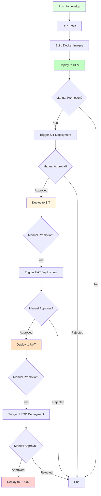

# Multi-Environment Deployment Guide

## 🎯 Overview

This document describes the multi-environment deployment pipeline for the Finance Tracker application. The pipeline supports 4 environments with manual promotion between stages.

## 📊 Environments

| Environment | Purpose | Trigger | Deployment Type |
|------------|---------|---------|-----------------|
| **DEV** | Development | Push to `develop` branch | Automatic |
| **SIT** | System Integration Testing | Manual workflow dispatch | Manual approval required |
| **UAT** | User Acceptance Testing | Manual workflow dispatch | Manual approval required |
| **PROD** | Production | Manual workflow dispatch | Manual approval required |

## 🔄 Deployment Flow



## 🚀 Deployment Workflow

### 1. DEV Environment (Automatic)

**Trigger:** Push to `develop` branch

**Process:**
1. Run unit tests
2. Build Docker images
3. Push to ECR
4. Deploy to DEV EC2 automatically
5. Run health checks

**Example:**
```bash
git checkout develop
git add .
git commit -m "Feature: Add new feature"
git push origin develop
```

### 2. SIT Environment (Manual)

**Trigger:** Manual workflow dispatch

**Process:**
1. Go to GitHub Actions tab
2. Select "Multi-Environment Deployment Pipeline"
3. Click "Run workflow"
4. Select branch: `develop` or `main`
5. Select environment: `SIT`
6. Click "Run workflow"
7. Wait for manual approval (if configured)
8. Deploy to SIT EC2
9. Run health checks

**Required GitHub Secrets:**
- `SIT_EC2_PRIVATE_KEY`
- `SIT_EC2_HOST`
- `SIT_POSTGRES_PASSWORD`
- `SIT_JWT_SECRET`
- `SIT_S3_BUCKET_NAME`
- `SIT_EC2_PUBLIC_IP`

### 3. UAT Environment (Manual)

**Trigger:** Manual workflow dispatch

**Process:**
1. Go to GitHub Actions tab
2. Select "Multi-Environment Deployment Pipeline"
3. Click "Run workflow"
4. Select branch: `develop` or `main`
5. Select environment: `UAT`
6. Click "Run workflow"
7. Wait for manual approval (if configured)
8. Deploy to UAT EC2
9. Run health checks

**Required GitHub Secrets:**
- `UAT_EC2_PRIVATE_KEY`
- `UAT_EC2_HOST`
- `UAT_POSTGRES_PASSWORD`
- `UAT_JWT_SECRET`
- `UAT_S3_BUCKET_NAME`
- `UAT_EC2_PUBLIC_IP`

### 4. PROD Environment (Manual)

**Trigger:** Manual workflow dispatch

**Process:**
1. Go to GitHub Actions tab
2. Select "Multi-Environment Deployment Pipeline"
3. Click "Run workflow"
4. Select branch: `main` (recommended)
5. Select environment: `PROD`
6. Click "Run workflow"
7. Wait for manual approval (if configured)
8. Deploy to PROD EC2
9. Run health checks

**Required GitHub Secrets:**
- `PROD_EC2_PRIVATE_KEY`
- `PROD_EC2_HOST`
- `PROD_POSTGRES_PASSWORD`
- `PROD_JWT_SECRET`
- `PROD_S3_BUCKET_NAME`
- `PROD_EC2_PUBLIC_IP`

## 🔐 Required GitHub Secrets

### Common Secrets (All Environments)
```
AWS_ACCESS_KEY_ID          # AWS access key for ECR/S3
AWS_SECRET_ACCESS_KEY      # AWS secret key for ECR/S3
```

### DEV Environment Secrets
```
DEV_EC2_PRIVATE_KEY        # SSH private key for DEV EC2
DEV_EC2_HOST               # DEV EC2 public IP or hostname
DEV_POSTGRES_PASSWORD      # PostgreSQL password for DEV
DEV_JWT_SECRET             # JWT secret for DEV
DEV_S3_BUCKET_NAME         # S3 bucket name for DEV
DEV_EC2_PUBLIC_IP          # DEV EC2 public IP
```

### SIT Environment Secrets
```
SIT_EC2_PRIVATE_KEY        # SSH private key for SIT EC2
SIT_EC2_HOST               # SIT EC2 public IP or hostname
SIT_POSTGRES_PASSWORD      # PostgreSQL password for SIT
SIT_JWT_SECRET             # JWT secret for SIT
SIT_S3_BUCKET_NAME         # S3 bucket name for SIT
SIT_EC2_PUBLIC_IP          # SIT EC2 public IP
```

### UAT Environment Secrets
```
UAT_EC2_PRIVATE_KEY        # SSH private key for UAT EC2
UAT_EC2_HOST               # UAT EC2 public IP or hostname
UAT_POSTGRES_PASSWORD      # PostgreSQL password for UAT
UAT_JWT_SECRET             # JWT secret for UAT
UAT_S3_BUCKET_NAME         # S3 bucket name for UAT
UAT_EC2_PUBLIC_IP          # UAT EC2 public IP
```

### PROD Environment Secrets
```
PROD_EC2_PRIVATE_KEY       # SSH private key for PROD EC2
PROD_EC2_HOST              # PROD EC2 public IP or hostname
PROD_POSTGRES_PASSWORD     # PostgreSQL password for PROD
PROD_JWT_SECRET            # JWT secret for PROD
PROD_S3_BUCKET_NAME        # S3 bucket name for PROD
PROD_EC2_PUBLIC_IP         # PROD EC2 public IP
```

## 📋 Setting Up GitHub Secrets

### Step 1: Navigate to Repository Settings
1. Go to your GitHub repository
2. Click on "Settings"
3. Click on "Secrets and variables" → "Actions"
4. Click "New repository secret"

### Step 2: Add Secrets
Add each secret with the corresponding value from the list above.

**Example:**
- Name: `DEV_EC2_HOST`
- Value: `ec2-xx-xx-xx-xx.compute-1.amazonaws.com`

## 🛡️ Configuring Manual Approvals

### Step 1: Add Environment Protection Rules
1. Go to repository Settings
2. Click on "Environments"
3. Click "New environment"
4. Create environments: `SIT`, `UAT`, `PROD`
5. For each environment:
   - Enable "Required reviewers"
   - Add reviewers (team members)
   - Enable "Wait timer" (optional, e.g., 30 minutes)
   - Enable "Deployment branches" (optional)

### Step 2: Configure Branch Protection
1. Go to repository Settings
2. Click on "Branches"
3. Add rule for `main` branch:
   - Require pull request reviews
   - Require status checks to pass
   - Require branches to be up to date

## 📊 Monitoring Deployments

### View Deployment Status
1. Go to "Actions" tab in GitHub
2. Click on the workflow run
3. View job status and logs
4. Check deployment environment URL

### Health Checks
Each deployment includes automated health checks:
- API Gateway: `http://<EC2_HOST>:8080/actuator/health`
- Ingestion Service: `http://<EC2_HOST>:8081/actuator/health`
- Analytics Service: `http://<EC2_HOST>:8084/actuator/health`

## 🔄 Rollback Procedure

If a deployment fails, you can rollback manually:

### Option 1: Automatic Rollback (If Configured)
The workflow includes a rollback job that runs automatically on failure.

### Option 2: Manual Rollback
1. SSH into the EC2 instance
2. Navigate to application directory
3. Checkout previous commit
4. Restart services

```bash
ssh -i private_key.pem ubuntu@<EC2_HOST>
cd /home/ubuntu/finance-tracker
git log  # Find previous commit hash
git checkout <previous-commit-hash>
docker-compose down
docker-compose up -d
```

## 🎯 Best Practices

### 1. Branch Strategy
- `develop` branch for DEV deployments
- `main` branch for PROD deployments
- Feature branches for development
- Pull requests for code review

### 2. Testing
- Run tests locally before pushing
- Review test coverage reports
- Test in DEV before promoting to SIT
- Perform integration testing in SIT
- Conduct UAT with stakeholders

### 3. Security
- Use different secrets for each environment
- Rotate secrets regularly
- Never commit secrets to repository
- Use environment-specific configurations

### 4. Monitoring
- Monitor deployment logs
- Check health checks after deployment
- Set up alerts for failures
- Review deployment metrics

### 5. Rollback Readiness
- Always have a rollback plan
- Document rollback procedures
- Test rollback process
- Keep previous versions accessible

## 🚨 Troubleshooting

### Deployment Fails
1. Check GitHub Actions logs
2. Verify all secrets are configured
3. Check EC2 instance status
4. Verify network connectivity
5. Review health check endpoints

### Health Check Fails
1. Check service logs on EC2
2. Verify environment variables
3. Check database connectivity
4. Review Docker container status
5. Check Kafka connectivity

### Permission Denied
1. Verify SSH key permissions
2. Check EC2 security groups
3. Verify IAM permissions
4. Review ECR access policies

## 📚 Additional Resources

- [GitHub Actions Documentation](https://docs.github.com/en/actions)
- [GitHub Environments](https://docs.github.com/en/actions/deployment/targeting-different-environments/using-environments-for-deployment)
- [AWS ECR Documentation](https://docs.aws.amazon.com/AmazonECR/)
- [Docker Compose Documentation](https://docs.docker.com/compose/)

## 🎓 Summary

The multi-environment deployment pipeline provides:
- ✅ Automatic deployment to DEV
- ✅ Manual promotion to SIT, UAT, PROD
- ✅ Manual approval gates
- ✅ Automated health checks
- ✅ Rollback capability
- ✅ Environment isolation
- ✅ Comprehensive monitoring

Follow this guide to set up and use the deployment pipeline effectively!
